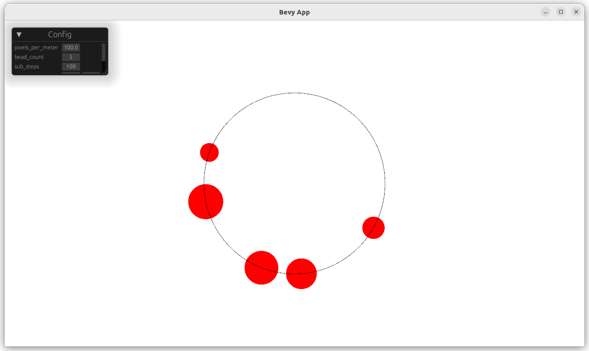
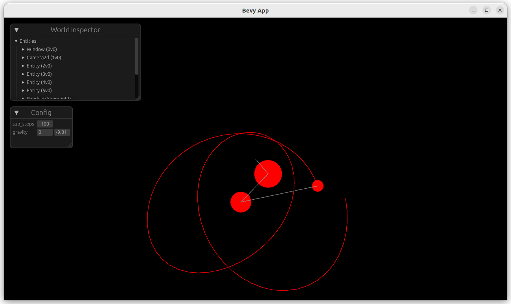
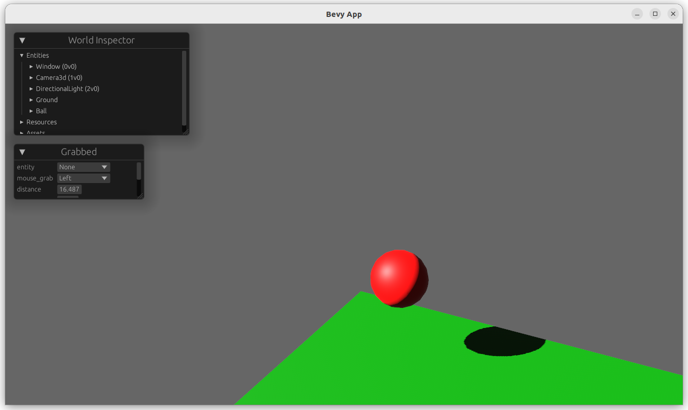
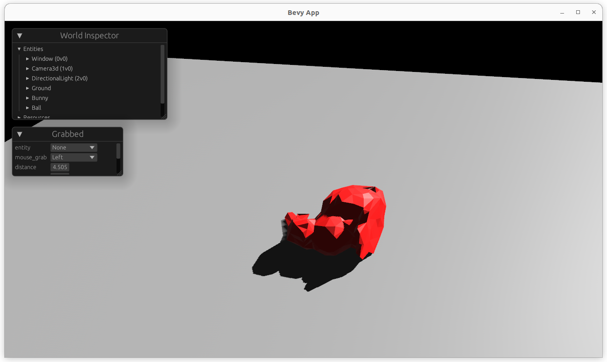
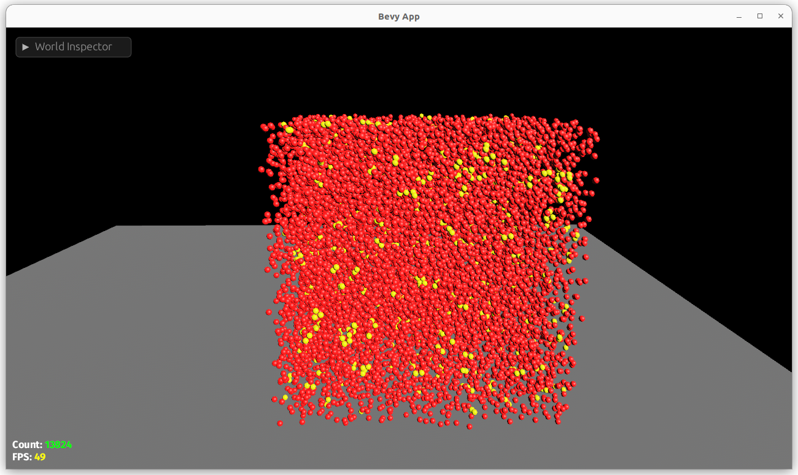

# Bevy Ten Minutes Physics

These are examples of how to use the [Bevy](https://bevyengine.org/) engine to create a simple physics simulations based on Matthias Muller's amazing [Ten Minute Physics](https://matthias-research.github.io/pages/tenMinutePhysics/index.html) tutorials, go check them out.

## Why?

I have playing around with creating a bevy native physics engine for a while, and while I have learned alot, they haven't been usable.  My lastest issue been has implementing a global solver for contraints.  Even with simple contrains it feels like you need a PHD (which I don't have) and so many advance optimazations to be performant, (sparse matrix representations for example) that the KISS principle is no where in sight.  That's why I am hopeful for XPBD, it seems to be a much simpler approach to solving the same problem.

## Tutorials

> These are not polished bevy or rust examples, I have done just enough to recreate Muller's examples.  I do plan on writing a xpbd physics plugin for bevy, this is not that plugin.

### 1. 2d physics

### 2. 3d physics

### 3. 2d ball collision

### 4. Pinball

### 5. Beads

### 6. Pendulum

### 7. 3d vector math
No code for this one.

### 8. User Interaction

### 9. XPBD
No code for this one.

### 10. Softbodies

### 11. Spatial Hashing

### 12. Speedup Softbodies

## Credits

- [Matthias Muller](https://matthias-research.github.io/pages/tenMinutePhysics/index.html) for the amazing tutorials, code, and papers.