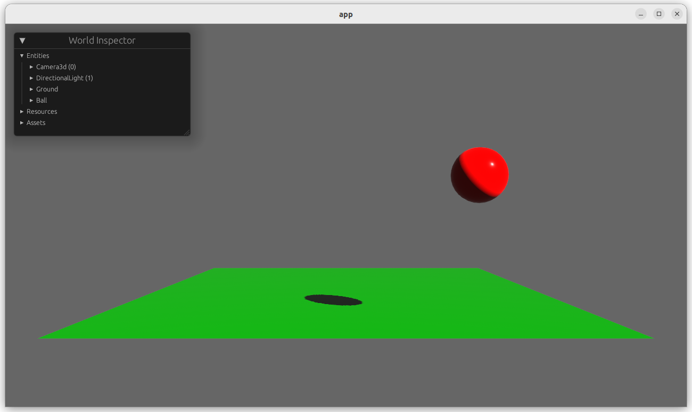
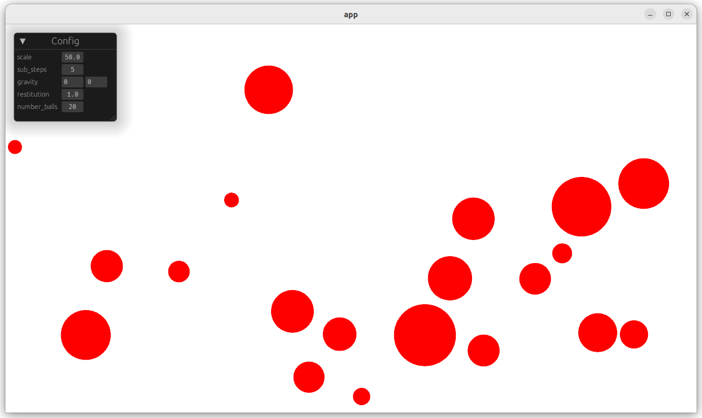
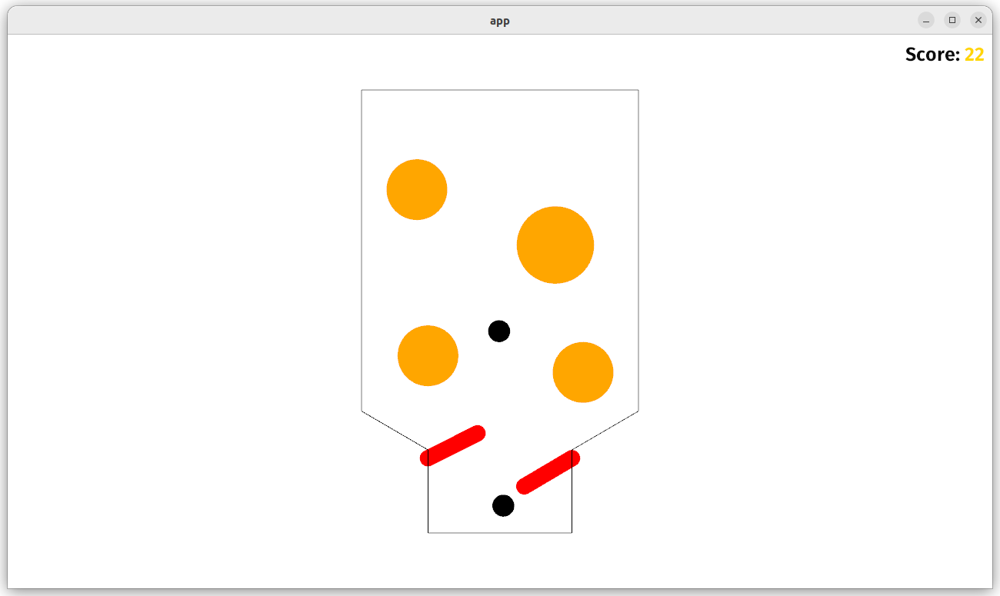

# Bevy Ten Minutes Physics

These are examples of how to use the [Bevy](https://bevyengine.org/) engine to create a simple physics simulations based on Matthias Muller's amazing [Ten Minute Physics](https://matthias-research.github.io/pages/tenMinutePhysics/index.html) tutorials, go check them out.

> Been playing with physics engine for a while in bevy, when to use xpbd and was having a few issues, so started this to build my way up to it.  These are not polished examples, just a way to learn and share.

## Tutorials

### 1. 2d physics

### 2. 3d physics

### 3. 2d ball collision

### 4. Pinball
